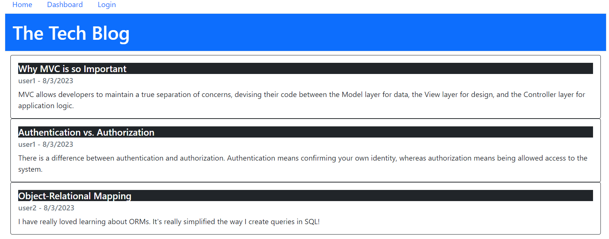

# refactored-octo-waffle-module-14-challenge
Module 14 Challenge

## Description

This web application allows the user to view posts made by other users on a tech blog.  You can also create you own account.  With an account, you can add comments to other's posts as well as create your own.

## Installation

N/A

## Usage

The application can be accessed at this URL: https://dry-mountain-43107-252c46a3f548.herokuapp.com/

To create a post, first sign up using the login link.  After signing up, click on the dashboard link and create a new post.  You can update or delete a post after it has been created.  To add comments, click on a post on the homepage and add a comment.

Tech blog screenshot:

## Credits

N/A

## License

N/A